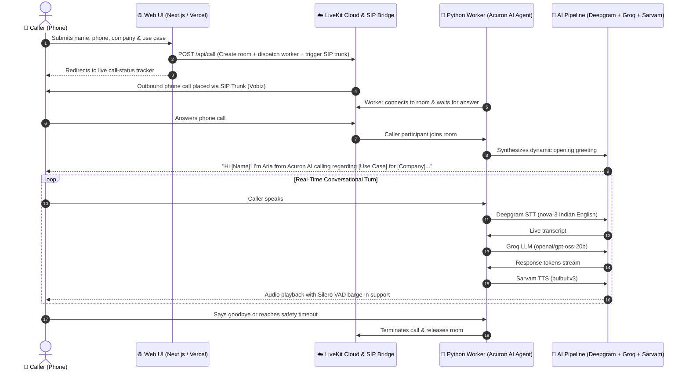

<div align="center">

# 🎙️ Acuron AI — Enterprise Voice Agent Demo

**Real-Time Outbound AI Voice Assistant powered by LiveKit, Deepgram, Groq & Sarvam AI**

[](https://www.python.org/)
[](https://nextjs.org/)
[](https://livekit.io/)
[](https://groq.com/)
[](https://www.sarvam.ai/)
[](LICENSE)

<p align="center">
  A customized enterprise voice demo built for <strong><a href="https://acuronai.com">Acuron AI</a></strong>. A visitor submits their name, company, and specific area of interest &rarr; an AI voice consultant (<strong>Aria</strong>) calls their phone within seconds &rarr; holds an interactive, context-aware spoken conversation &rarr; concludes gracefully.
</p>

</div>

---

## ⚡ System Architecture



---

## 🛠️ Tech Stack & AI Pipeline

| Component | Provider / Technology | Description |
|---|---|---|
| **Web Frontend** | Next.js 15 (App Router), TypeScript, CSS Modules | Responsive Acuron AI branded form with interactive solution chip selector |
| **Media & Telephony** | LiveKit Cloud + SIP Trunking (Vobiz) | WebRTC real-time audio rooms and PSTN outbound telephone calls (+91 India) |
| **Speech-to-Text (STT)** | Deepgram (`nova-3`, `en-IN`) | Streaming speech recognition tuned for Indian English telephone audio |
| **Language Model (LLM)** | Groq (`openai/gpt-oss-20b`) | Ultra-fast token generation on Groq LPU hardware for human-paced responses |
| **Text-to-Speech (TTS)** | Sarvam AI (`bulbul:v3`, `en-IN`) | High-fidelity, natural Indian accent voice synthesis |
| **Voice Activity Detection** | Silero VAD | Real-time speech detection and instant user interruption (barge-in) |
| **Worker Framework** | LiveKit Agents Python SDK 1.8 | Asynchronous pipeline orchestrating STT &rarr; LLM &rarr; TTS with caller-answered gating |

---

## 🏎️ Latency Analysis & Optimization

During live testing, response latency is shaped by the physical network hops:

```
[Local Dev Topology (Higher Latency)]:
User Phone (India) ──> Vobiz Trunk (India) ──> LiveKit Cloud (North America)
                                                        │
                                                        ▼
API Providers <── Local Machine (India) <────── WebSocket Audio
```

### Why latency is higher during local testing:
- **Geographic Cross-Tripping**: Audio from the phone in India travels to the LiveKit Cloud region (e.g. Canada/US), streams down to your local machine in India over residential broadband, calls AI APIs, and travels back up to the LiveKit server before reaching the phone.
- **Local Network Buffering**: Residential internet connections have variable jitter compared to cloud datacenter uplinks.

### Production Optimization (Sub-500ms Response):
- **Deploy Worker Close to LiveKit**: Deploying the Python worker on Railway or Render in the same geographic region as your LiveKit Cloud server and SIP trunk eliminates cross-continental hops.
- **Direct Streaming Pipeline**: LiveKit Agents streams STT chunks directly into Groq and streams first LLM sentence tokens straight to Sarvam TTS without waiting for full paragraphs.

---

## 📁 Repository Structure

```
voice-agent/
├── .gitignore                      # Excludes secrets, venvs, node_modules
├── pyrefly.toml                    # Pyrefly Python type-checker configuration
├── PRD.md                          # Product Requirements Document
├── README.md                       # Complete setup & deployment guide
├── docs/
│   └── DEMO_SCRIPT.md              # Step-by-step live demo script
├── agent/                          # Python Voice Agent Worker
│   ├── .env.example                # Example environment variables for worker
│   ├── agent.py                    # Worker entrypoint, pipeline & greeting timing
│   ├── persona.py                  # Acuron AI personality, prompts & solutions context
│   ├── requirements.txt            # Python dependencies (Python 3.13)
│   └── Procfile                    # Deployment process definition (Railway)
└── web/                            # Next.js Web Application
    ├── .env.example                # Example environment variables for web
    ├── package.json                # Web package scripts and dependencies
    ├── next.config.ts              # Next.js configuration
    └── src/
        ├── app/
        │   ├── page.tsx            # Acuron AI call request form with use case chips
        │   ├── page.module.css     # Dark mode aesthetics & interactive chip styling
        │   ├── globals.css         # Design tokens & typography
        │   ├── api/call/route.ts   # API to trigger LiveKit SIP dispatch with metadata
        │   ├── api/call-status/    # Live call polling endpoint
        │   └── call-status/[id]/   # Visual status tracker UI
        └── lib/
            └── livekit-server.ts   # LiveKit Server SDK helper
```

---

## 🚀 Getting Started Locally

### Prerequisites
- **Python 3.13**
- **Node.js 18+** & `npm`
- **Accounts & API Keys**:
  - [LiveKit Cloud](https://cloud.livekit.io/) (URL, API Key, API Secret)
  - [Deepgram Console](https://console.deepgram.com/) (API Key)
  - [Groq Console](https://console.groq.com/) (API Key)
  - [Sarvam AI](https://app.sarvam.ai/) (API Key)
  - [Vobiz](https://vobiz.in/) (or any SIP trunk provider for Indian telephone numbers)

---

### Step 1: Clone the Repository

```bash
git clone https://github.com/adi-bhagat20/voice-agent.git
cd voice-agent
```

---

### Step 2: Set Up the Python Agent Worker

1. Navigate to `agent/` and create your virtual environment:
   ```bash
   cd agent
   py -3.13 -m venv voice-env
   ```

2. Activate the environment:
   - **Windows (PowerShell)**:
     ```powershell
     .\voice-env\Scripts\activate
     ```
   - **macOS / Linux**:
     ```bash
     source voice-env/bin/activate
     ```

3. Install dependencies:
   ```bash
   pip install -r requirements.txt
   ```

4. Configure environment variables in `agent/.env`:
   ```env
   LIVEKIT_URL=wss://your-project.livekit.cloud
   LIVEKIT_API_KEY=your_livekit_api_key
   LIVEKIT_API_SECRET=your_livekit_api_secret
   DEEPGRAM_API_KEY=your_deepgram_key
   GROQ_API_KEY=your_groq_key
   SARVAM_API_KEY=your_sarvam_key
   ```

5. Start the agent worker:
   ```bash
   python agent.py start
   ```
   *(Or test text-only in console mode with `python agent.py console`)*

---

### Step 3: Run the Web Application

1. Open a second terminal in the `web/` directory:
   ```bash
   cd web
   npm install
   ```

2. Configure environment variables in `web/.env.local`:
   ```env
   LIVEKIT_URL=wss://your-project.livekit.cloud
   LIVEKIT_API_KEY=your_livekit_api_key
   LIVEKIT_API_SECRET=your_livekit_api_secret
   SIP_OUTBOUND_TRUNK_ID=ST_xxxxxxxxxxxxxxxx
   ```

3. Start the Next.js dev server:
   ```bash
   npm run dev
   ```
   Open `http://localhost:3000` to submit your demo request.

---

## 🎭 Acuron AI Persona & Solutions Configuration

All personality, company domain knowledge, and greetings are managed in [`agent/persona.py`](agent/persona.py):

- **Agent Name**: **Aria** (AI Solutions Consultant at Acuron AI).
- **Company Tagline**: *"Enterprise AI Systems That Run Your Business"*.
- **Solutions Covered**:
  - **AI Voice & Receptionist**: Low latency voice agents for inbound support & outbound scheduling.
  - **Workflow & Claims Automation**: Automated insurance claims, internal request pipelines, CRM integration.
  - **Healthcare & Biomedical AI**: Specialized medical and biological workflow assistants.
  - **Vision & Threat Detection**: Real-time perimeter monitoring and safety surveillance.
- **Dynamic Greeting**: Automatically personalizes the greeting to reference the user's name, company, and selected use case.
- **Call Boundaries**: Enforces concise phone-friendly turns and terminates politely on goodbye phrases or a 3-minute limit.

---

## 🌐 Production Deployment

### 1. Agent Worker &rarr; [Railway](https://railway.app/)
1. Create a new Railway project and choose **Deploy from GitHub Repo**.
2. Select your `voice-agent` repository.
3. Set the **Root Directory** to `/agent`.
4. Under **Variables**, add all keys from `agent/.env`.
5. Railway detects the [`Procfile`](agent/Procfile) (`worker: python agent.py start`) and keeps the worker continuously connected to LiveKit.

### 2. Web UI &rarr; [Vercel](https://vercel.com/)
1. Import the `voice-agent` repository into Vercel.
2. Set the **Root Directory** to `web`.
3. Add the environment variables from `web/.env.local`.
4. Deploy!

---

## 📄 License

This project is licensed under the [MIT License](LICENSE).
