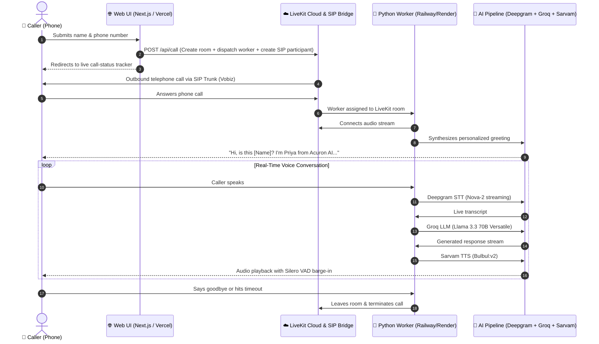

<div align="center">

# 🎙️ "Call Me" — AI Voice Agent Demo

**Real-Time Outbound AI Voice Assistant powered by LiveKit, Deepgram, Groq & Sarvam AI**

[](https://www.python.org/)
[](https://nextjs.org/)
[](https://livekit.io/)
[](https://groq.com/)
[](https://www.sarvam.ai/)
[](LICENSE)

<p align="center">
  A visitor submits their name and phone number on a modern web app &rarr; an AI voice receptionist calls their phone within seconds &rarr; holds an ultra-low-latency, natural spoken conversation &rarr; hangs up gracefully.
</p>

</div>

---

## ⚡ System Architecture



---

## 🛠️ Tech Stack & AI Pipeline

| Component | Provider / Technology | Description |
|---|---|---|
| **Web Frontend** | Next.js 15 (App Router), TypeScript, CSS Modules | Clean, responsive call request form and live status monitor |
| **Media & Telephony** | LiveKit Cloud + SIP Trunking (Vobiz) | WebRTC real-time audio rooms and PSTN outbound telephone calls |
| **Speech-to-Text (STT)** | Deepgram (`nova-2`) | Streaming, ultra-fast transcription tuned for conversational phone audio |
| **Language Model (LLM)** | Groq (`llama-3.3-70b-versatile`) | Blazing fast sub-200ms token generation for human-paced responses |
| **Text-to-Speech (TTS)** | Sarvam AI (`bulbul:v2`) | High-fidelity Indian English & multilingual voice synthesis |
| **Voice Activity Detection** | Silero VAD | Real-time speech detection and seamless user interruption (barge-in) |
| **Worker Framework** | LiveKit Agents Python SDK 1.8 | Asynchronous pipeline orchestrating STT &rarr; LLM &rarr; TTS |

---

## 📁 Repository Structure

```
voice-agent/
├── .gitignore                      # Excludes secrets, venvs, node_modules
├── pyrefly.toml                    # Pyrefly Python type-checker configuration
├── PRD.md                          # Product Requirements Document
├── README.md                       # Complete setup & deployment guide
├── docs/
│   └── DEMO_SCRIPT.md              # Step-by-step live demo script
├── agent/                          # Python Voice Agent Worker
│   ├── .env.example                # Example environment variables for worker
│   ├── agent.py                    # Worker entrypoint and audio pipeline
│   ├── persona.py                  # Agent personality, prompts & greetings
│   ├── requirements.txt            # Python dependencies (Python 3.13)
│   └── Procfile                    # Deployment process definition (Railway)
└── web/                            # Next.js Web Application
    ├── .env.example                # Example environment variables for web
    ├── package.json                # Web package scripts and dependencies
    ├── next.config.ts              # Next.js configuration
    └── src/
        ├── app/
        │   ├── page.tsx            # Main call request form
        │   ├── globals.css         # Design tokens & styling
        │   ├── api/call/route.ts   # API to trigger LiveKit SIP dispatch
        │   ├── api/call-status/    # Live call polling endpoint
        │   └── call-status/[id]/   # Visual status tracker UI
        └── lib/
            └── livekit-server.ts   # LiveKit Server SDK helper
```

---

## 🚀 Getting Started Locally

### Prerequisites
- **Python 3.13** (recommended for LiveKit Agents 1.8)
- **Node.js 18+** & `npm`
- **Accounts & API Keys**:
  - [LiveKit Cloud](https://cloud.livekit.io/) (URL, API Key, API Secret)
  - [Deepgram Console](https://console.deepgram.com/) (API Key)
  - [Groq Console](https://console.groq.com/) (API Key)
  - [Sarvam AI](https://app.sarvam.ai/) (API Key)
  - [Vobiz](https://vobiz.in/) (or any SIP trunking provider for phone calls)

---

### Step 1: Clone the Repository

```bash
git clone https://github.com/adi-bhagat20/voice-agent.git
cd voice-agent
```

---

### Step 2: Set Up & Test the Python Agent

1. Navigate to `agent/` and set up your virtual environment:
   ```bash
   cd agent
   py -3.13 -m venv voice-env
   ```

2. Activate the virtual environment:
   - **Windows (PowerShell)**:
     ```powershell
     .\voice-env\Scripts\activate
     ```
   - **macOS / Linux**:
     ```bash
     source voice-env/bin/activate
     ```

3. Install dependencies:
   ```bash
   pip install -r requirements.txt
   ```

4. Configure environment variables:
   ```bash
   cp .env.example .env
   ```
   Edit `.env` with your API keys:
   ```env
   LIVEKIT_URL=wss://your-project.livekit.cloud
   LIVEKIT_API_KEY=your_livekit_api_key
   LIVEKIT_API_SECRET=your_livekit_api_secret
   DEEPGRAM_API_KEY=your_deepgram_key
   GROQ_API_KEY=your_groq_key
   SARVAM_API_KEY=your_sarvam_key
   ```

5. Run local test in **Console Mode** (no phone call required):
   ```bash
   python agent.py console
   ```
   *Type in the console to test the prompt, persona, and voice response pipeline.*

6. Run the agent worker:
   ```bash
   python agent.py start
   ```

---

### Step 3: Set Up & Run the Web Application

1. Open a new terminal in the `web/` directory:
   ```bash
   cd web
   npm install
   ```

2. Configure environment variables:
   ```bash
   cp .env.example .env.local
   ```
   Edit `.env.local`:
   ```env
   LIVEKIT_URL=wss://your-project.livekit.cloud
   LIVEKIT_API_KEY=your_livekit_api_key
   LIVEKIT_API_SECRET=your_livekit_api_secret
   SIP_OUTBOUND_TRUNK_ID=ST_xxxxxxxxxxxxxxxx
   ```

3. Start development server:
   ```bash
   npm run dev
   ```
   Visit `http://localhost:3000` to access the call request form.

---

## 📞 Outbound SIP Trunk Configuration (Vobiz)

To place outbound phone calls to Indian numbers (+91), configure your SIP trunk in LiveKit:

1. Install the LiveKit CLI:
   ```bash
   npm install -g @livekit/livekit-cli
   ```
2. Authenticate with LiveKit Cloud:
   ```bash
   lk cloud auth
   ```
3. Create the outbound SIP trunk:
   ```bash
   lk sip outbound create \
     --name "vobiz-india" \
     --address "<vobiz-sip-host>" \
     --username "<vobiz-username>" \
     --password "<vobiz-password>" \
     --numbers "+91XXXXXXXXXX"
   ```
4. Copy the resulting **Trunk ID** (`ST_...`) into `web/.env.local` as `SIP_OUTBOUND_TRUNK_ID`.

---

## 🎭 Customizing Agent Persona & Instructions

All personality, instructions, greeting styles, and conversation boundaries are centralized in [`agent/persona.py`](agent/persona.py):

- **`AGENT_NAME`**: Name of the assistant (default: `"Priya"`).
- **`BUSINESS_NAME`**: Company represented (default: `"Acuron AI"`).
- **`SYSTEM_PROMPT`**: Detailed instructions, tone, and conversation goals.
- **`GREETING_WITH_NAME`**: Personalized opening line when the caller provides a name.
- **`GOODBYE_PHRASES`**: Phrases triggering an immediate, polite hangup.
- **`MAX_CALL_DURATION_SECONDS`**: Hard safety cap on call length (default: 180 seconds).

---

## 🌐 Production Deployment

### 1. Agent Worker &rarr; [Railway](https://railway.app/)
1. Create a new Railway project and choose **Deploy from GitHub Repo**.
2. Select `voice-agent`.
3. Set the **Root Directory** to `/agent`.
4. Under **Variables**, add all keys from `agent/.env`.
5. Railway will automatically detect the [`Procfile`](agent/Procfile) (`worker: python agent.py start`) and start the persistent worker.

### 2. Web UI &rarr; [Vercel](https://vercel.com/)
1. Import your `voice-agent` repository into Vercel.
2. Set the **Root Directory** to `web`.
3. Add the environment variables from `web/.env.local`.
4. Deploy!

---

## 🛡️ Security & Best Practices

- **Never commit `.env` or `.env.local` files**: Both are strictly excluded in `.gitignore`.
- **Server-side only credentials**: LiveKit API secrets, Deepgram keys, Groq keys, and Sarvam keys remain strictly on the backend worker and serverless route.
- **Hard Call Timeouts**: Calls automatically terminate after 3 minutes to avoid dangling trunk charges.

---

## 📄 License

This project is licensed under the [MIT License](LICENSE).
